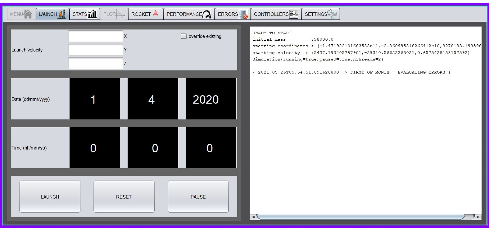
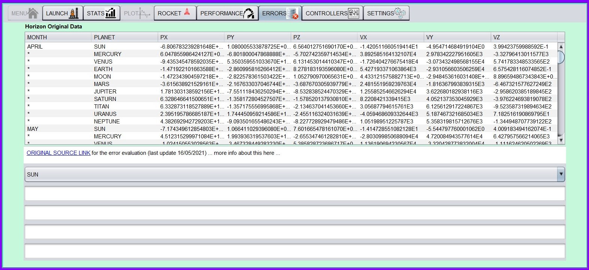

# Project1_2 DKE Group 17

# MISSION TITAN

# Installation

Required Gradle versions: 7.0.2 . note if some problems arise,it could be that the -all distribution package is
necessary

### Required gradle-wrapper.properties

```properties
distributionBase=GRADLE_USER_HOME
distributionPath=wrapper/dists
distributionUrl=https\://services.gradle.org/distributions/gradle-7.0.2-all.zip
zipStoreBase=GRADLE_USER_HOME
zipStorePath=wrapper/dists
```

### Preferred gradle dependencies / testing task properties

```groovy
dependencies {
    implementation 'org.junit.jupiter:junit-jupiter:5.7.0'
    implementation group: 'au.com.bytecode', name: 'opencsv', version: '2.4'
    implementation group: 'org.apache.commons', name: 'commons-csv', version: '1.8'
    compileOnly 'org.jetbrains:annotations:20.1.0'
    testImplementation 'org.junit.jupiter:junit-jupiter:5.6.2'
}

test {
    useJUnitPlatform()
    testLogging {
        events 'passed', 'skipped', 'failed'
    }
    maxParallelForks 1
    minHeapSize "128m"
    maxHeapSize "512m"
    failFast true
    onOutput { descriptor, event -> logger.lifecycle("Test: " + descriptor + " \noutput: " + event.message )}
    finalizedBy jacocoTestReport
}

```

### Compiler

```xml
<?xml version="1.0" encoding="UTF-8"?>
<project version="4">
  <component name="CompilerConfiguration">
    <bytecodeTargetLevel target="15" /> 
  </component>
</project>
```

# Usage

[Config.java](src/main/java/group17/Utils/Config.java)

#### Check out all the available configurations it is possible to select!

Most of them are available in runtime too, so make sure you try all of them ![they're a lot!]

[they're a lot!]: src/main/resources/icons/7.jpg

### Initialise the assist window and the simulation instance

[Main.java](src/main/java/group17/Main.java)

```java
import group17.phase1.group17.phase1.Titan.Interfaces.SimulationInterface;

public class Main {

    public static volatile SimulationInterface simulation;
    public static UserDialogWindow userDialog = new UserDialogWindow();

    public static void main(String[] args) {
    }
}
```

### create a pre-defined Simulation from assist window

[UserDialogWindow.java](src/main/java/group17/Graphics/UserDialogWindow.java) [Config.java](src/main/java/group17/Utils/Config.java)

```java
public class Config{
    public static Boolean LAUNCH_ASSIST = true;
    public static Boolean ENABLE_GRAPHICS = true;}
}
public class UserDialogWindow {
    private Component initMenu() {
        this.menu = new AbstractMainMenu() {
            @Override public void startSimulation() {
                if (simulation == null) {
                    Main.simulation = new Simulation();
                    Main.simulation.setAssist(userAssist);  //optional
                    Main.simulation.init();
                    Main.simulation.start();
                }
            }
        };
        this.menu.configFrame(new JPanel());
    }
}
```

### Set up a simulation

[Simulation.java](src/main/java/group17/Simulation/Simulation.java)

```java
@Override 
public void init() {
    this.initReporter();   //first thing, will check all exceptions
    this.initSystem();  // before graphics and userDialog (clock, positions init, ...)
    this.initAssist();
    this.initGraphics();
    this.initUpdater();  //last thing, will start the simulation if it's the only one running
}

@Override 
public void start() {
    this.setRunning();
    ScheduledExecutorService service = Executors.newSingleThreadScheduledExecutor(Executors.privilegedThreadFactory());
    service.scheduleWithFixedDelay(this::loop, 30, 9, MILLISECONDS);
}

@Override
public synchronized void loop() {
    if (this.running) {
        this.updateState();
        this.startGraphics();
        this.startReport();
        this.startAssist();
        if (!waiting()) {
            this.startUpdater();
            this.startSystem();
        }
    }
}
```

# ROCKET EVENTS

[LaunchAssistWindow.java](src/main/java/group17/Graphics/Assist/LaunchAssistWindow.java)
[AbstractLaunchAssist.java](src/main/java/group17/Graphics/Assist/AbstractLaunchAssist.java)

From the launching assist it is possible to directly plan a rocket decision that will be applied at launching time. Here
are the main buttons for switching between the simulation states, such as running, paused or reset to initial
conditions.

## UML Diagram

[UML](src/main/resources/Main.uml)

## ERRORS EVALUATION



By default, it is possible to allow the program to generate runtime live reports , and it is possible to let it
automatically store txt or csv files. Data for the error evaluation have been collected from the [NASA Horizon Website].

[Nasa Horizon Website]: <https://ssd.jpl.nasa.gov/horizons.cgi>

```java
public class Config{
    public static final Format FORMAT = Format.NO_OUTPUT;
}
```

If this configuration is selected during the simulation process, the generated files will be collected in the
resources/ErrorData folder, organised by solver and step size used If selected during tests (by enabling
SolversAccuracyTest.java) these files will be collected in the test/java/resources/ErrorData folder,as by standard
organization.

NOTE : the ErrorData folder MUST be present in both cases, if this options is selected NOTE : to allow the report
generation it is **_required_**  to let the simulation Clock to get to the **_first of the month at the exact time "00:
00:00"_**. Check out the implementation of [Clock.java](src/main/java/group17/Simulation/System/Clock.java) or stick to
step size exactly dividing a minute by a natural, integer number.

# Early Release

We left to the user some leaks about future features we are intended to implement as deprecated, to discourage the usage
of them since they haven't been fully tested and integrated.

## Contributing

Group 17, who contributed at this project :

Dan Parii, Lorenzo Pompigna, Nikola Prianikov, Axel Rozental, Konstantin Sandfort, Abhinandan Vasudevan (phase 1 only)

